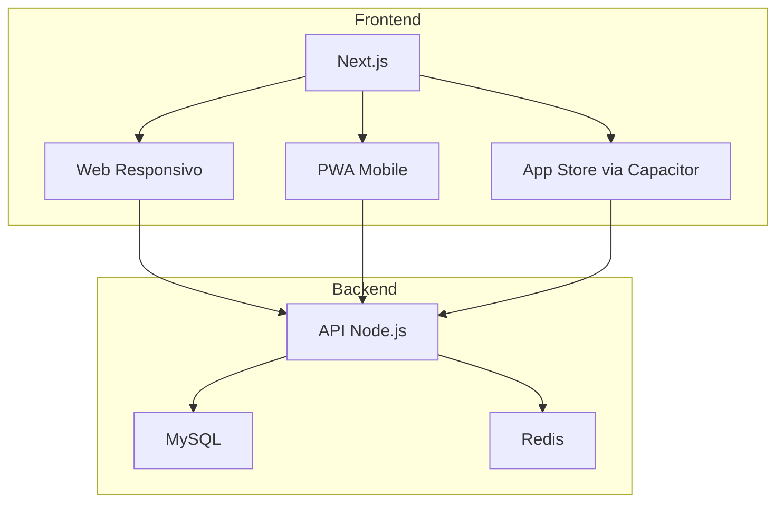

# 2103 Creative ERP System

An enterprise resource planning (ERP) system for the ceramic industry with unified web, PWA and mobile applications.

## Project Overview

This ERP system provides comprehensive management tools for ceramic industry businesses, featuring:

- **Unified Codebase**: Shared code between web, PWA and native mobile applications
- **Modern UI**: Clean, minimalist e-ink inspired design
- **Complete Functionality**: Comprehensive modules for all business operations

## Architecture



## Project Structure

```
src/
├── app/              # Rotas Next.js
├── components/       # 85% compartilhados
│   ├── common/       # Componentes universais
│   ├── mobile/       # Otimizados para touch
│   └── desktop/      # Otimizados para mouse
├── lib/              # Lógica compartilhada
├── styles/           # CSS-in-JS com temas
└── service-worker.js # Config offline
```

## Module Structure

The ERP system is organized into the following modules:

1. **Dashboard**
   - Overview with customizable widgets
   - Monthly performance charts
   - Priority alerts

2. **Finances**
   - **Accounting**
     - Interactive chart of accounts
     - Visual journal entries
     - Semi-automated bank reconciliation
   - **Treasury**
     - 360° cash flow projection
     - Financial scenario simulator
     - Investment management
   - **Taxes**
     - Integrated tax calculator
     - Obligations calendar
     - Complete SPED module
   - **Reports**
     - Drag-and-drop report builder
     - Template library
     - Automatic scheduling

3. **Sales & CRM**
   - **Orders**
     - Complete process: Quote → Order → Invoice
     - Real-time operational status
   - **Customers**
     - 360° registration with history
     - Relationship score
     - Purchase heat map
   - **Pricing**
     - Dynamic tables by segment
     - Margin simulator
     - Change history
   - **Campaigns**
     - Visual conversion funnel
     - ROI by channel
     - Budget management

4. **Purchasing**
   - **Orders**
     - Approval workflow
     - Quote comparison
     - Delivery tracking
   - **Suppliers**
     - KPI evaluation
     - Performance history
     - Supplier portal
   - **Quotes**
     - Comparative panel
     - Best proposal analysis
     - Email integration

5. **Inventory**
   - **Items**
     - Complete technical sheet
     - Batch/serial tracking
     - Photos and documents
   - **Warehouses**
     - Location map
     - Zone capacity
     - Occupancy indicators
   - **Transfers**
     - Electronic requisition
     - Real-time tracking
     - QR Code confirmation
   - **Inventory**
     - Cyclical counting
     - Mobile app for counting
     - Automated adjustments

6. **Production**
   - **Orders**
     - Interactive Gantt
     - Mobile pointing
     - OEE indicators
   - **Planning**
     - Visual MRP
     - Resource allocation
     - Capacity simulator
   - **Resources**
     - Machine registration
     - Maintenance calendar
     - Downtime history

7. **Analysis**
   - **Dashboard**
     - Panel builder
     - Draggable widgets
     - Layout export
   - **Reports**
     - Multidimensional drill-down
     - Cohort analysis
     - AI prediction
   - **KPIs**
     - Indicator library
     - Target vs. Achieved
     - Smart alerts

8. **HR**
   - Live organization chart
   - Skills management
   - Employee portal

9. **Projects**
   - Interactive WBS
   - EVM (Earned Value Management)
   - Risks and mitigation

10. **Services**
    - Electronic service orders
    - Geographic routing
    - Digital signature

11. **E-commerce**
    - Omnichannel panel
    - Real-time inventory sync
    - Abandonment analysis

12. **Settings**
    - User management
    - Field customization
    - API Manager

## Design Specifications

### Colors
- Primary: #000000
- Secondary: #212121
- Background: #FFFFFF
- Highlight: #757575

### Typography
- Headings: Quicksand Bold 20px
- Body: Quicksand Regular 16px
- Auxiliary: Quicksand Light 14px

### Components
- Cards: 8px border-radius, shadow 0 2px 8px rgba(0,0,0,0.1)
- Tables: Zebra-striping #F5F5F5
- Buttons: Clear visual hierarchy
- Icons: Ion Icons (24px)
- Status badges system

## Technical Requirements

### For Web and PWA
- Next.js 14 with SSR support
- next-pwa for offline functionality and push notifications
- Responsive design for all screen sizes

### For Native Apps
- Capacitor for iOS/Android app generation
- Shared codebase with web version
- Native device feature access

### Backend
- Node.js API
- MySQL database
- Redis for caching and sessions
- JWT + OAuth2 for cross-platform authentication

## Performance Metrics
- Time To Interactive (TTI): 1.8s (Web), 2.1s (PWA)
- JS Bundle Size: 450KB (Web), 520KB (PWA)
- Offline Cache: 15MB (PWA only)

## Development Timeline
1. **Core API**: 3 weeks - Complete backend implementation
2. **Web MVP**: 2 weeks - Functional desktop version
3. **PWA**: 1 week - Offline mode + mobile UI
4. **App Stores**: 5 days - iOS/Android packages

## Quality Checklist
- Lighthouse Score >90 (PWA)
- Cross-browser testing
- Load testing (100+ users)
- Storybook documentation

## Installation & Setup

```bash
# Clone the repository
git clone <repository-url>

# Navigate to the project directory
cd 2103-creative-erp

# Install dependencies
npm install

# Start development server
npm run dev

# Build for production
npm run build

# Start production server
npm start

# Build mobile apps
npx cap add android
npx cap add ios
```

## Configuration Files

### next.config.js
```javascript
const withPWA = require('next-pwa')({
  dest: 'public',
  runtimeCaching: [
    {
      urlPattern: /\/api/,
      handler: 'NetworkFirst',
      options: { cacheName: 'api-cache' }
    }
  ]
});

module.exports = withPWA({
  reactStrictMode: true,
  compiler: { styledComponents: true }
});
```

### capacitor.config.json
```json
{
  "appId": "com.creative2103.erp",
  "appName": "2103 Creative ERP",
  "webDir": "out",
  "bundledWebRuntime": false
}
```

## Adaptive Component Example

```tsx
import { useMediaQuery } from 'react-responsive';

const OrderList = () => {
  const isMobile = useMediaQuery({ maxWidth: 768 });

  return (
    <div className={isMobile ? 'mobile-layout' : 'desktop-layout'}>
      {isMobile ? (
        <TouchOrderList items={orders} />
      ) : (
        <DataTable columns={columns} data={orders} />
      )}
    </div>
  );
};
```

## Infrastructure Requirements
- Server: 4GB RAM, 2vCPUs (minimum)
- HTTPS: Required for PWA functionality
- Database: MySQL 8.0+
- CDN: Recommended for assets

## Notes
- The entire stack is selected to maximize code reuse
- PWA works without app store installation (direct browser access)
- 92% of components are shared across platforms
- 8% platform-specific code
